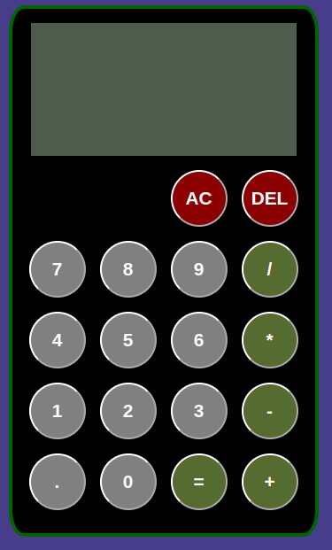

# simple-calculator
A simple calculator built to practice DOM manipulation and modular javascript.
The layout is generated dynamically with javascript, and the app is structured with a clear separation between display logic and calculator functionality.

## Features
- Keyboard input support (numbers, operators, enter, backspace)
- Basic arithmetic operations:
    - Addition
    - Subtraction
    - Multiplication
    - Division
- Live display updates
- Delete (DEL) and all clear (AC) functionality
- Responsive button layout using flexbox

## Built with
- Javascript
- HTML
- CSS
  
## Future improvements
- Prevent division by zero (show error instead of infinity)
- Disallow multiple leading zeros.

## Image
